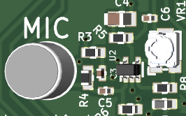

# Microfone, DMA e Matriz de LEDs

A seguir, será desenvolvido o projeto que permite realizar a amostragem com o microfone onboard, utilização do Analog Digital Converter (ADC) juntamente com a função Direct Memory Access (DMA) e então processamento do sinal, para que de acordo com a intensidade do sinal sonoro captado pelo microfone, a matriz de LEDs se acenda.   

## Introdução
 
### Características do Sinal de saída do Microfone:
  
O microfone presente na placa, quando não está sujeito a nenhum som, tem um output de tensão igual ao seu offset, que vale 1,65V. Quando o microfone recebe sinais sonoros, a depender da intensidade e frequência do som recebido, sua tensão oscila com frequência equivalente à do sinal recebido, e com maior amplitude a depender da intensidade do som.  
- Offset: 1,65 V (centro da faixa do ADC), podendo ser ajustado com um trimpot.  
- Amplitude máxima: 1,65 V de deslocamento para cima ou para baixo, atingindo 0 V na parte inferior e 3,3 V na parte superior.  
- Range total do sinal: 0 a 3,3 V.  

Como o ADC opera com uma referência de 3,3 V, isso significa que você está usando **toda a faixa dinâmica do ADC**, o que é desejável para maximizar a resolução e a qualidade da leitura.  
  
O Conversor Analógico-Digital (ADC) do RP2040, utilizado no Raspberry Pi Pico, possui as seguintes características:

### 1. Faixa de Medição (Range)  
- **Tensão de Referência (VREF):** A faixa de medição do ADC é de 0V a VREF, sendo que VREF é fixado internamente em 3.3V no RP2040. Isso significa que ele pode medir tensões analógicas entre 0V e 3.3V.  

### 2. Resolução do ADC   
- O ADC do RP2040 tem uma **resolução de 12 bits**, ou seja: ele gera valores inteiros entre **0** (correspondendo a 0V) e (2^12 - 1) = **4095** (correspondendo a 3.3V). A **resolução mínima (step size)** é:  

 $$Resol. = V_{ref}/2^{12} = 3.3/4096 \thickapprox 0.00080586 V = 805.86 \mu V$$ 

  
### 3. Conversão de Valores para short signed  
ADC do RP2040 fornece valores sem sinal de 12 bits (**0 a 4095**), e o objetivo é convertê-los para um intervalo com sinal (**-2048 a 2047**) para armazenar o valor em um *short signed*.    
A fórmula de conversão é:  
  
Signed value = raw_adc_value − 2048  
  
Isso ajusta o valor bruto lido pelo ADC para variar em torno de 0, com um mínimo de -2048 e máximo de 2047. Isso reflete o comportamento do sinal em torno do ponto de offset de 1,65 V. Sem som, temos então que a saída analógica do microfone é 1,65 V sendo convertido para 0.   
  
É possível fazer esta leitura do sinal digital convertido do microfone e transformar proporcionalmente num valor pwm com 1kHz para acender um led (catodo comum) na cor azul que está ligado no GPIO 12, mas não é o que esse código faz.  
  
### 4. Outras Observações  
- O ADC do RP2040 possui uma entrada de **referência interna**, então o valor de **3.3V** depende da precisão da fonte de alimentação do sistema.

## Desenvolvimento do programa:  

A seguir desenvolvemos, passo-a-passo,  as etapas de síntese de um programa, em linguagem C, para realizar a leitura dos sinais de um microfone presente na BitDogLab.

## Desenvolvimento: 

Como ponto de partida podemos identificar os elementos, ou interfaces, de entrada e saída que serão usados no nosso hardware para implementar este projeto.  
  
A interface de entrada é um componente denominado microfone, que tem uma saída de tensão que varia de acordo com a intensidade e frequência de determinado sinal sonoro ao qual o dispositivo é submetido, e então a leitura é realizada pelo conversor analógico digital e executa uma ação baseada nesse sinal.  
  
Como funciona:  
  
Um microfone é um dispositivo que converte ondas sonoras em sinais elétricos. Ele capta as vibrações do ar causadas por sons e as transforma em um sinal elétrico proporcional à intensidade sonora. Esse processo é essencial para uma ampla gama de aplicações, como gravações de áudio, sistemas de reconhecimento de voz e controle por som em projetos de eletrônica. Na figura abaixo, à esquerda, temos a visão 3D do circuito do microfone na placa BitDog Lab, e à direita, o esquema elétrico desse circuito.   

     
Figura: Visão 3d do circuito do microfone e seu esquema elétrico com os componentes necessários para o circuito funcionar da forma correta realizando a leitura dos sinais sonoros.  
  
O circuito inclui componentes como capacitores, resistores, indutores e um amplificador operacional MAX4466, que realiza o condicionamento do sinal proveniente do microfone. Muitas vezes, esse sinal possui uma amplitude baixa, e para que seja possível sua leitura, é necessário amplificá-lo e filtrá-lo, logo o circuito realiza esse processamento do sinal elétrico, e é esse sinal já tratado adequadamente que é recebido pela GPIO 28 da placa.  

